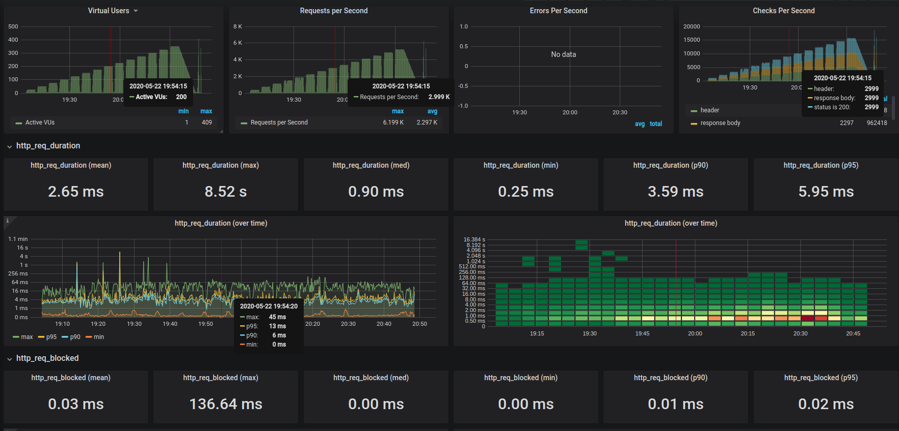
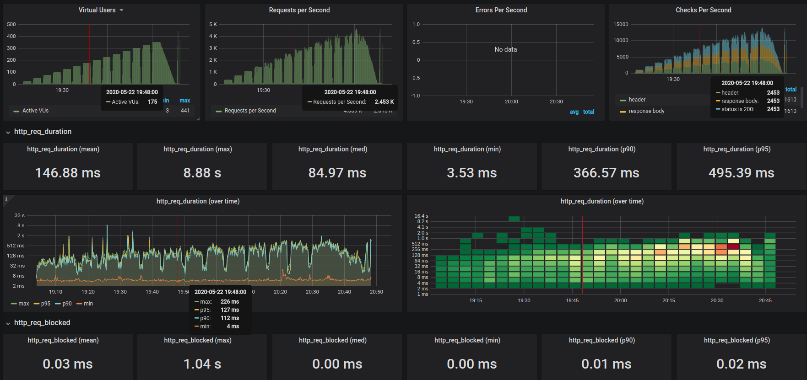
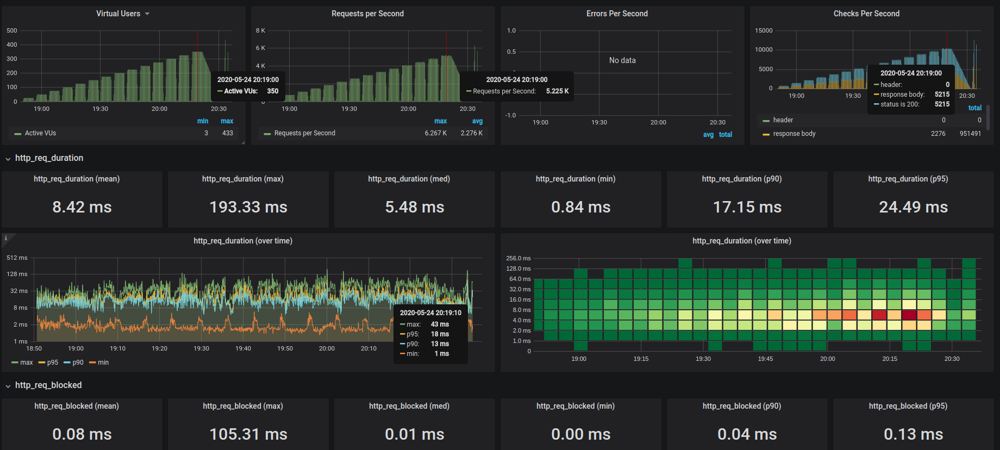

[](https://codecov.io/gh/n0npax/sidecar_http_dispatcher)
[](https://app.codacy.com/manual/n0npax/sidecar_http_dispatcher?utm_source=github.com&utm_medium=referral&utm_content=n0npax/sidecar_http_dispatcher&utm_campaign=Badge_Grade_Settings)
[](https://badges.mit-license.org)
[](https://GitHub.com/n0npax/sidecar_http_dispatcher/issues/)


---

On this page
- [sidecar http dispatcher](#sidecar-http-dispatcher)
  - [Why](#why)
  - [How](#how)
  - [Example](#example)
    - [E2E](#e2e)
  - [Configuration](#configuration)
    - [Passing config](#passing-config)
    - [Config schema](#config-schema)
  - [Project CI/CD](#project-cicd)
  - [Performance](#performance)
    - [Http req duration](#http-req-duration)
    - [Grafana screenshots](#grafana-screenshots)
  - [Project evolution](#project-evolution)

---

**Like it? Star it!!!**


---
# sidecar http dispatcher

Easy dispatcher which may mitigate properiatery/legacy software limitations

## Why

You are using traffic enricher developed by `acme corp` which is very expensive it doesn't support any dispatching.
You can  deploy new copy per env/endpoint, but it cost too much. You can also use `sidecar http dispatcher` to provide missing functionality next to rooten component.

## How

Using [Ambassador pattern](https://docs.microsoft.com/en-us/azure/architecture/patterns/ambassador) act as `mitm` and apply required transformations.


## Example

Assuming [example](./example) was deployed to `kubernetes` using minikube

Pod `acme-enricher-6d9c4bd5b-fhld7` was created
```bash
$kubectl get po
NAME                            READY   STATUS    RESTARTS   AGE
acme-enricher-6d9c4bd5b-fhld7   2/2     Running   0          5m44s
```

and `service` was exposed as:
```bash
minikube service acme-enricher --url=true
http://192.168.39.206:30314
```

An http request to exposed service was made
```bash
curl -H 'environment: dev' http://192.168.39.206:30314/
```

Request will hit `acme-enricher` which will redirect traffic to `acme-properiatery-software` in pod using `localhost:5000` address.
```bash
kubectl exec -it acme-enricher-6d9c4bd5b-fhld7  -c acme-properiatery-software -- tail -f /var/log/nginx/access.log
remote_addr:172.17.0.1  time_local:17/May/2020:04:39:43 +0000   method:GET      uri:/   host:192.168.39.206     status:404      bytes_sent:345  referer:- seragent:curl/7.65.3   forwardedfor:-  request_time:0.382
```

Sidecar will patch request and make a call as `mitm`
```bash
kubectl logs acme-enricher-6d9c4bd5b-fhld7 -c sidecar-http-dispatcher -f
Running on http://127.0.0.1:5000 (CTRL + C to quit)
INFO:quart.serving:Running on 127.0.0.1:5000 over http (CTRL + C to quit)
[2020-05-17 04:25:56,258] Running on 127.0.0.1:5000 over http (CTRL + C to quit)
INFO:quart.serving:127.0.0.1:41346 GET / 1.0 404 345 373429
[2020-05-17 04:26:29,720] 127.0.0.1:41346 GET / 1.0 404 345 373429
INFO:quart.serving:127.0.0.1:41354 GET /favicon.ico 1.0 404 103 952
[2020-05-17 04:26:30,107] 127.0.0.1:41354 GET /favicon.ico 1.0 404 103 952
INFO:sidecar http dispatcher:patching headers: [{'key': 'Host', 'val': 'example.com'}, {'key': 'dispatched', 'val': True}]
```

And as we can see, dispatched request was made to final destination
```bash
sudo tcpdump -i wlp3s0 -nn -s0 -v port 80
14:27:25.260330 IP (tos 0x0, ttl 62, id 53987, offset 0, flags [DF], proto TCP (6), length 60)
    192.168.1.24.59238 > 93.184.216.34.80: Flags [S], cksum 0xbe47 (correct), seq 2664131577, win 64240, options [mss 1460,sackOK,TS val 1591297495 ecr 0,nop,wscale 7], length 0
14:27:25.426356 IP (tos 0x0, ttl 56, id 26241, offset 0, flags [none], proto TCP (6), length 60)
    93.184.216.34.80 > 192.168.1.24.59238: Flags [S.], cksum 0x4871 (correct), seq 3615428991, ack 2664131578, win 65535, options [mss 1452,sackOK,TS val 20350599 ecr 1591297495,nop,wscale 9], length 0
14:27:25.426968 IP (tos 0x0, ttl 62, id 53988, offset 0, flags [DF], proto TCP (6), length 52)
    192.168.1.24.59238 > 93.184.216.34.80: Flags [.], cksum 0x749a (correct), ack 1, win 502, options [nop,nop,TS val 1591297662 ecr 20350599], length 0
14:27:25.429880 IP (tos 0x0, ttl 62, id 53989, offset 0, flags [DF], proto TCP (6), length 298)
    192.168.1.24.59238 > 93.184.216.34.80: Flags [P.], cksum 0xa18f (correct), seq 1:247, ack 1, win 502, options [nop,nop,TS val 1591297664 ecr 20350599], length 246: HTTP, length: 246
        GET /default HTTP/1.1
        Host: 192.168.39.206
        Remote-Addr: 127.0.0.1
        Enriched: true
        X-Real-Ip: 172.17.0.1
        Connection: close
        User-Agent: curl/7.65.3
        Accept: */*
        Environment: dev
        Host: example.com
        dispatched: True
        Accept-Encoding: gzip, deflate

14:27:25.637488 IP (tos 0x0, ttl 57, id 26254, offset 0, flags [none], proto TCP (6), length 52)
```

And as you can see IP for final destination in logs matches expected one:
```bash
ping example.com -c1
PING example.com (93.184.216.34) 56(84) bytes of data.
64 bytes from 93.184.216.34 (93.184.216.34): icmp_seq=1 ttl=57 time=165 ms

--- example.com ping statistics ---
1 packets transmitted, 1 received, 0% packet loss, time 0ms
rtt min/avg/max/mdev = 164.694/164.694/164.694/0.000 ms
```

Which basically proves that given request was passed to domain `example.com` base on provided configuration.
```bash
curl 'localhost:5000' -H 'environment: dev'
<!doctype html>
<html>
<head>
    <title>Example Domain</title>

    <meta charset="utf-8" />
...
```

### E2E

Very similar flow(`example.com` replaced with local `destination-app`) is provided as basic End to End test inside [deploy](./example/deploy) script. For detail please check [Project CI/CD](#project-cicd)

## Configuration

### Passing config

App is reading configuration from path specified by environment variable `SIDECAR_CONFIG`. If variable is not setup, it fallback to `config.yaml`.

### Config schema

```yaml
rewrites: # set of rewrite rules
  dev: # value of key propery. i.e -H 'environment: dev'
    patch: # action type
      - key: Host # header key
        val: example.com # header value
      - key: dispatched
        val: true
    destination: http://example.com # (optional) destination url
key: environment # key used to dispatch request
destination: http://example.org # default destination url
```

## Project CI/CD

Check [workflows](.github/workflows/).

## Performance

Given data were generated for tags: `0.0.2` and `0.0.3`

Environment:

|                | Host | Minikube |
| -------------- | ---- | -------- |
| CPU (i7-8550U) | 8cpu | 4vcpu    |
| RAM            | 32   | 8        |

### Http req duration

| version    | max(ms) | p95(ms) | p90(ms) | min(ms) | Vus |
| ---------- | ------- | ------- | ------- | ------- | --- |
| bare       | 45      | 13      | 6       | 0       | 200 |
| 0.0.2 (py) | 170     | 144     | 128     | 4       | 200 |
| 0.0.3 (go) | 57      | 34      | 24      | 1       | 200 |


### Grafana screenshots

| performance                 |
| --------------------------- |
| Direct proxy pass           |
|   |
| 0.0.2 (py)                  |
|  |
| 0.0.3 (go)                  |
|  |

## Project evolution

First version of this project was developed using python `asgi` using [quart](https://pgjones.gitlab.io/quart/) framework.
This old version is tagged as [0.0.2](https://github.com/n0npax/sidecar_http_dispatcher/releases/tag/0.0.2) and due to [not sufficent performance](#http-req-duration) was rewritten using `golang` which significantly improves performance.
